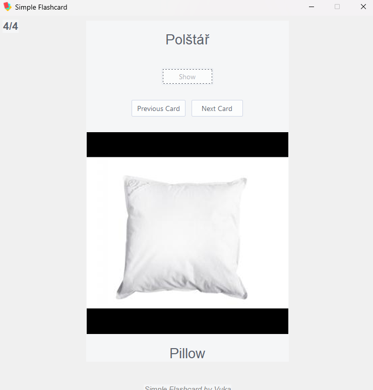

# Simple fleshcard app

### What is this?

- This is a simple flash card app

### Why was it made?

- During my Czech lessons, I often jot down new words and their meanings in a text editor. I realized that organizing them within an app would be more efficient than keeping them in a single large text file (after all, a JSON file serves the same purpose).
- While my primary motivation for creating this was language learning, it could be valuable for various memorization tasks as well.

### Features

- Normal flashcard features
  

## Known Issues

-

## To Improve

- Navigation using keyboard instead of mouse?

## Imporatant docs pages

- https://docs.python.org/3/library/tkinter.html
- https://ttkthemes.readthedocs.io/en/latest/themes.html
- https://pypi.org/project/pillow/

**Note**: If you do find issues or ways to improve the code feel free to open an issue and or a MR
